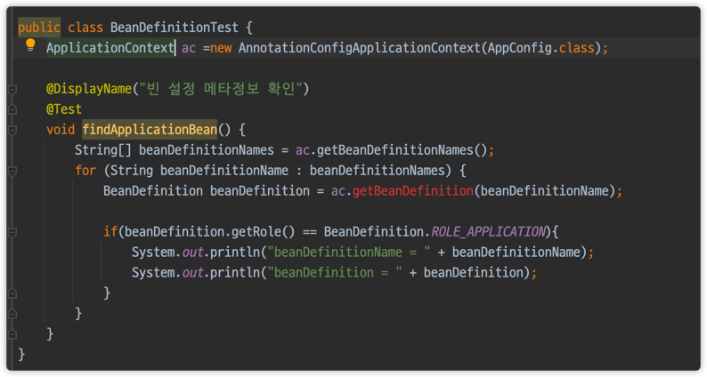

# 스프링은 어떻게 다양한 설정 형식을 지원하는 것일까?
- `BeanDefinition` 덕분이다.
    - XML 읽어서 BeanDefinition 만들기
    - 자바 코드를 읽어서 BeanDefinition 만들기
    - 스프링 컨테이너는 자바 코드인지, XML인지 몰라도 됨. 오직 `BeanDefinition`만 알면 된다.
    
> BeanDefinition
- 빈 설정 메타 정보
- `@Bean`, `<bean>`


```java
public class AnnotationConfigApplicationContext extends GenericApplicationContext implements AnnotationConfigRegistry {
    private final AnnotatedBeanDefinitionReader reader;
    private final ClassPathBeanDefinitionScanner scanner;

    public AnnotationConfigApplicationContext() {
        StartupStep createAnnotatedBeanDefReader = this.getApplicationStartup().start("spring.context.annotated-bean-reader.create");
        this.reader = new AnnotatedBeanDefinitionReader(this);
        createAnnotatedBeanDefReader.end();
        this.scanner = new ClassPathBeanDefinitionScanner(this);
    }

    public AnnotationConfigApplicationContext(DefaultListableBeanFactory beanFactory) {
        super(beanFactory);
        this.reader = new AnnotatedBeanDefinitionReader(this);
        this.scanner = new ClassPathBeanDefinitionScanner(this);
    }

    public AnnotationConfigApplicationContext(Class<?>... componentClasses) {
        this();
        this.register(componentClasses);
        this.refresh();
    }

    public AnnotationConfigApplicationContext(String... basePackages) {
        this();
        this.scan(basePackages);
        this.refresh();
    }

    public void setEnvironment(ConfigurableEnvironment environment) {
        super.setEnvironment(environment);
        this.reader.setEnvironment(environment);
        this.scanner.setEnvironment(environment);
    }

    public void setBeanNameGenerator(BeanNameGenerator beanNameGenerator) {
        this.reader.setBeanNameGenerator(beanNameGenerator);
        this.scanner.setBeanNameGenerator(beanNameGenerator);
        this.getBeanFactory().registerSingleton("org.springframework.context.annotation.internalConfigurationBeanNameGenerator", beanNameGenerator);
    }

    public void setScopeMetadataResolver(ScopeMetadataResolver scopeMetadataResolver) {
        this.reader.setScopeMetadataResolver(scopeMetadataResolver);
        this.scanner.setScopeMetadataResolver(scopeMetadataResolver);
    }

    public void register(Class<?>... componentClasses) {
        Assert.notEmpty(componentClasses, "At least one component class must be specified");
        StartupStep registerComponentClass = this.getApplicationStartup().start("spring.context.component-classes.register").tag("classes", () -> {
            return Arrays.toString(componentClasses);
        });
        this.reader.register(componentClasses);
        registerComponentClass.end();
    }

    public void scan(String... basePackages) {
        Assert.notEmpty(basePackages, "At least one base package must be specified");
        StartupStep scanPackages = this.getApplicationStartup().start("spring.context.base-packages.scan").tag("packages", () -> {
            return Arrays.toString(basePackages);
        });
        this.scanner.scan(basePackages);
        scanPackages.end();
    }

    public <T> void registerBean(@Nullable String beanName, Class<T> beanClass, @Nullable Supplier<T> supplier, BeanDefinitionCustomizer... customizers) {
        this.reader.registerBean(beanClass, beanName, supplier, customizers);
    }
}
```

> BeanDefinition
- `AnnotationConfigApplicationContext`는 `AnnotatedBeanDefinitionReader`를 사용해서 `AppConfig.class` 를 읽고 BeanDefinition 을 생성한다.
- `GenericXmlApplicationContext`는 `XmlBeanDefinitionReader`를 사용해서 `appConfig.xml` 설정 정보를 읽고 BeanDefinition 을 생성한다.
- 새로운 형식의 설정 정보가 추가되면, `XxxBeanDefinitionReader`를 만들어서 BeanDefinition 을 생성 하면 된다.

- BeanClassName: 생성할 빈의 클래스 명(자바 설정 처럼 팩토리 역할의 빈을 사용하면 없음) 
- factoryBeanName: 팩토리 역할의 빈을 사용할 경우 이름, 예) appConfig 
- factoryMethodName: 빈을 생성할 팩토리 메서드 지정, 예) memberService
- Scope: 싱글톤(기본값)
- lazyInit: 스프링 컨테이너를 생성할 때 빈을 생성하는 것이 아니라, 실제 빈을 사용할 때 까지 최대한 생성을 지연처리 하는지 여부
- InitMethodName: 빈을 생성하고, 의존관계를 적용한 뒤에 호출되는 초기화 메서드 명 
- DestroyMethodName: 빈의 생명주기가 끝나서 제거하기 직전에 호출되는 메서드 명 
- Constructor arguments, Properties: 의존관계 주입에서 사용한다. (자바 설정 처럼 팩토리 역할 의 빈을 사용하면 없음)

````java
public class BeanDefinitionTest {
    AnnotationConfigApplicationContext ac =new AnnotationConfigApplicationContext(AppConfig.class);

    @DisplayName("빈 설정 메타정보 확인")
    @Test
    void findApplicationBean() {
        String[] beanDefinitionNames = ac.getBeanDefinitionNames();
        for (String beanDefinitionName : beanDefinitionNames) {
            BeanDefinition beanDefinition = ac.getBeanDefinition(beanDefinitionName);

            if(beanDefinition.getRole() == BeanDefinition.ROLE_APPLICATION){
                System.out.println("beanDefinitionName = " + beanDefinitionName);
                System.out.println("beanDefinition = " + beanDefinition);
            }
        }
    }
}
````

위의 출력결과는 다음과 같다.
```
beanDefinitionName = appConfig
beanDefinition = Generic bean: class [hello.core.AppConfig$$EnhancerBySpringCGLIB$$b4655797]; scope=singleton; abstract=false; lazyInit=null; autowireMode=0; dependencyCheck=0; autowireCandidate=true; primary=false; factoryBeanName=null; factoryMethodName=null; initMethodName=null; destroyMethodName=null
beanDefinitionName = memberService
beanDefinition = Root bean: class [null]; scope=; abstract=false; lazyInit=null; autowireMode=3; dependencyCheck=0; autowireCandidate=true; primary=false; factoryBeanName=appConfig; factoryMethodName=memberService; initMethodName=null; destroyMethodName=(inferred); defined in hello.core.AppConfig
beanDefinitionName = memberRepository
beanDefinition = Root bean: class [null]; scope=; abstract=false; lazyInit=null; autowireMode=3; dependencyCheck=0; autowireCandidate=true; primary=false; factoryBeanName=appConfig; factoryMethodName=memberRepository; initMethodName=null; destroyMethodName=(inferred); defined in hello.core.AppConfig
beanDefinitionName = orderService
beanDefinition = Root bean: class [null]; scope=; abstract=false; lazyInit=null; autowireMode=3; dependencyCheck=0; autowireCandidate=true; primary=false; factoryBeanName=appConfig; factoryMethodName=orderService; initMethodName=null; destroyMethodName=(inferred); defined in hello.core.AppConfig
beanDefinitionName = discountPolicy
beanDefinition = Root bean: class [null]; scope=; abstract=false; lazyInit=null; autowireMode=3; dependencyCheck=0; autowireCandidate=true; primary=false; factoryBeanName=appConfig; factoryMethodName=discountPolicy; initMethodName=null; destroyMethodName=(inferred); defined in hello.core.AppConfig
```

참고로 
위와 같이 ApplicationContext로는 getBean을 할 수 없음. (추가적인 상속이 필요하다는 것)

---

XML Config 확인
```java
public class BeanDefinitionTest {
    GenericXmlApplicationContext ac =new GenericXmlApplicationContext("appConfig.xml");

    @DisplayName("빈 설정 메타정보 확인")
    @Test
    void findApplicationBean() {
        String[] beanDefinitionNames = ac.getBeanDefinitionNames();
        for (String beanDefinitionName : beanDefinitionNames) {
            BeanDefinition beanDefinition = ac.getBeanDefinition(beanDefinitionName);

            if(beanDefinition.getRole() == BeanDefinition.ROLE_APPLICATION){
                System.out.println("beanDefinitionName = " + beanDefinitionName);
                System.out.println("beanDefinition = " + beanDefinition);
            }
        }
    }
}
```
결과
```java
beanDefinitionName = memberService
beanDefinition = Generic bean: class [hello.core.member.MemberServiceImpl]; scope=; abstract=false; lazyInit=false; autowireMode=0; dependencyCheck=0; autowireCandidate=true; primary=false; factoryBeanName=null; factoryMethodName=null; initMethodName=null; destroyMethodName=null; defined in class path resource [appConfig.xml]
beanDefinitionName = memberRepository
beanDefinition = Generic bean: class [hello.core.member.MemoryMemberRepository]; scope=; abstract=false; lazyInit=false; autowireMode=0; dependencyCheck=0; autowireCandidate=true; primary=false; factoryBeanName=null; factoryMethodName=null; initMethodName=null; destroyMethodName=null; defined in class path resource [appConfig.xml]
beanDefinitionName = orderService
beanDefinition = Generic bean: class [hello.core.order.OrderServiceImpl]; scope=; abstract=false; lazyInit=false; autowireMode=0; dependencyCheck=0; autowireCandidate=true; primary=false; factoryBeanName=null; factoryMethodName=null; initMethodName=null; destroyMethodName=null; defined in class path resource [appConfig.xml]
beanDefinitionName = discountPolicy
beanDefinition = Generic bean: class [hello.core.discount.RateDiscountPolicy]; scope=; abstract=false; lazyInit=false; autowireMode=0; dependencyCheck=0; autowireCandidate=true; primary=false; factoryBeanName=null; factoryMethodName=null; initMethodName=null; destroyMethodName=null; defined in class path resource [appConfig.xml]
```

결과가 조금 다르다. AppConfig는 어디갔는가?
`AppConfig.java`는 팩토리 메서드로 등록한 것. 
`AppConfig.xml`은 직접 빈을 등록한 것
- AnnotationConfig는 팩토리 메서드 방식, AppConfig는 직접 등록
- 일반적으로 자바 코드로 빈설정을 하기 때문에 팩토리 빈 방식으로 빈을 등록한다는 것을 알고 넘어가자


