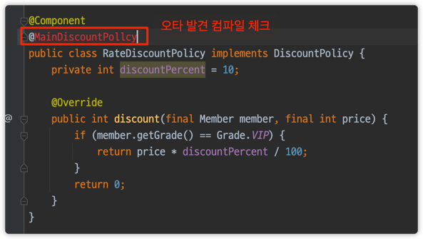

# 어노테이션을 직접 만들어보자

- `@Qualifier("mainDiscountPolicy")` 이렇게 문제를 적으면 컴파일 시 타입 체크가 안된다.
- 내가 사용할 때 잘못 썼으면 어떡하지? `@Qualifier("mainDiscountPollcy")`
- 역시 가장 좋은 에러는 컴파일 시 에러!
    - 이를 위해 어노테이션을 만들어본다.
    

```java
@Target({ ElementType.FIELD, ElementType.METHOD, ElementType.PARAMETER, ElementType.TYPE, ElementType.ANNOTATION_TYPE})
@Retention(RetentionPolicy.RUNTIME)
@Inherited
@Documented
@Qualifier("mainDiscountPolicy")
public @interface MainDiscountPolicy {
}
```

이제 다음과 같이 수정하고 사용하면 된다.

```java
@Component
@MainDiscountPolicy
public class RateDiscountPolicy implements DiscountPolicy {
    private int discountPercent = 10;

    @Override
    public int discount(final Member member, final int price) {
        if (member.getGrade() == Grade.VIP) {
            return price * discountPercent / 100;
        }
        return 0;
    }
}
```

```java
@Component
public class OrderServiceImpl implements OrderService {
    private final MemberRepository memberRepository;
    private final DiscountPolicy discountPolicy;

    public OrderServiceImpl(final MemberRepository memberRepository, @MainDiscountPolicy final DiscountPolicy discountPolicy) {
        this.memberRepository = memberRepository;
        this.discountPolicy = discountPolicy;
    }

    @Override
    public Order createOrder(final Long memberId, final String itemName, final int itemPrice) {
        Member member = memberRepository.findById(memberId);
        int discountPrice = discountPolicy.discount(member, itemPrice);

        return new Order(memberId, itemName, itemPrice, discountPrice);
    }

    // 테스트 용
    public MemberRepository getMemberRepository() {
        return memberRepository;
    }
}
```

참고로 이 방식은 컴파일 시점에 에러를 잡아주기도 하고, 코드 추적도 가능하다.



- 어노테이션은 상속이라는 개념이 없다.
- 여러 어노테이션을 모아서 사용하는 기능은 스프링이 지원해주는 기능이다.
- `@Qualifier` 뿐 아니라, 다른 어노테이션들도 함께 조합해서 사용할 수 있다.
- 단적으로 `@Autowired`도 재정의할 수 있다. 물론 무분별한 재정의는 혼란만 가중할 수 있다.
