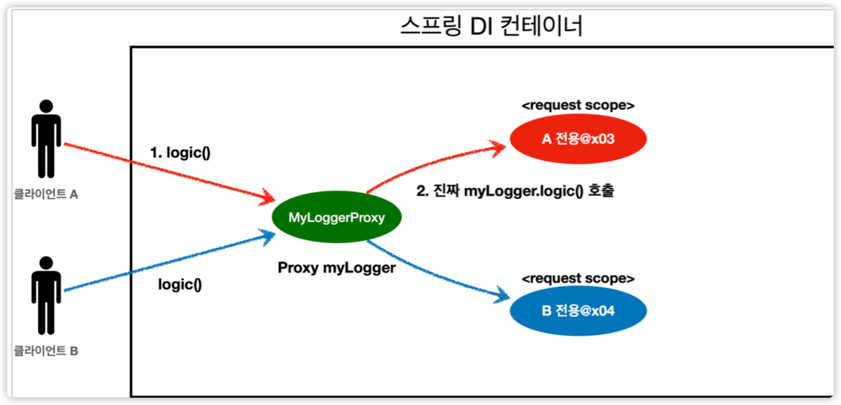

# 웹 스코프

- 웹 스코프는 프로토 타입과 다르게 스프링이 해당 스코프의 종료 시점까지 관리해준다. 따라서 종료 콜백 호출된다.

- 웹 스코프 종류
    - request : http 요청 하나가 들어오고 나갈 떄까지 유지되는 스코프, 각각의 http 요청마다 별도의 빈 인스턴스가 생성되고 관리된다.
    - session : http session과 동일한 생명 주기를 가지는 스코프
    - application : 서블릿 컨텍스트(`SevletContext`)와 동일한 생명주기를 가지는 스코프
    - websocket : 웹소켓과 동일한 생명주기를 가지는 스코프

예제 만들어보기

```java
@Component
@Scope(value = "request")
public class MyLogger {
    private String uuid;
    private String requestURL;

    public void setRequestURL(final String requestURL) {
        this.requestURL = requestURL;
    }

    public void log(String message) {
        System.out.println("[" + uuid + "][" + requestURL + "]" + message);
    }

    @PostConstruct
    public void init() {
        uuid = UUID.randomUUID().toString(); // 로또 of 로또 of 로또의 확률로 겹치지 않음
        System.out.println("[" + uuid + "][" + requestURL + "] request scope bean create: " + this);

    }

    @PreDestroy
    public void close() {
        System.out.println("[" + uuid + "][" + requestURL + "] request scope bean close: " + this);
    }
}
```
```java
@RequiredArgsConstructor
@Service
public class LogDemoService {

  private final MyLogger myLogger;

  public void logic(final String id) {
    myLogger.log("service id = " + id);
  }
}

```

````java
@Controller
@RequiredArgsConstructor
public class LogDemoController {
    private final LogDemoService logDemoService;
    private final MyLogger myLogger; // 그냥 실행하면 현재 request 스콥인 상태에서는 MyLogger가 스콥이 아니라서(생존 범위가 아님) 스프링에서 DI를 원하지만 줄 것이 없음
    // -> Provider로 해결

    @RequestMapping("log-demo")
    @ResponseBody // 화면이 없어서 뷰 렌더링 거치지 않고 바로 문자로 반환할 것
    public String logDemo(HttpServletRequest request) {
        final String requestURL = request.getRequestURL().toString();
        myLogger.setRequestURL(requestURL);

        myLogger.log("controller test");
        logDemoService.logic("testId");
        return "OK";
    }
}
````
참고로, requestURL을 MyLogger에 저장하는 부분은 컨트롤러보다는 공통 처리가 가능한 스프링 인터셉터나 서블릿 필터 같은 곳을 활용하는 것이 더 좋음!


하지만 실행하면 다음과 같은 싱글톤이라는 단어와 함께 에러 로그가 뜬다.
```text
org.springframework.beans.factory.UnsatisfiedDependencyException: Error creating bean with name 'logDemoController' defined in file [/Users/user/Documents/github/spring/spring-core-example/out/production/classes/hello/core/web/LogDemoController.class]: Unsatisfied dependency expressed through constructor parameter 1; nested exception is org.springframework.beans.factory.support.ScopeNotActiveException: Error creating bean with name 'myLogger': Scope 'request' is not active for the current thread; consider defining a scoped proxy for this bean if you intend to refer to it from a singleton; nested exception is java.lang.IllegalStateException: No thread-bound request found: Are you referring to request attributes outside of an actual web request, or processing a request outside of the originally receiving thread? If you are actually operating within a web request and still receive this message, your code is probably running outside of DispatcherServlet: In this case, use RequestContextListener or RequestContextFilter to expose the current request.
	at org.springframework.beans.factory.support.ConstructorResolver.createArgumentArray(ConstructorResolver.java:800) ~[spring-beans-5.3.7.jar:5.3.7]
```

즉, MyLogger는 request scope인데, 이를 스프링이 뜰 때 DI시 달라고 요청하고 있으니, 없다고~~ 뺴액 소리 지르면서 서버 구동조차 안되게 된다.
그래서 이걸 Provider로 해결할 수도 있겠다.

- 웹과 관련된 부분은 컨트롤러까지만 사용해야 한다. 서비스 계층은 웹 기술에 종속되지 않고, 가급적 순수하게 유지하는 것이 유지보수 관점에서 좋다.
- request scope의 MyLogger 덕분에 이런 부분을 파라미터로 넘기지 않고, MyLogger의 멤버변수에 저장해서 코드와 계층을 깔끔하게 유지할 수 있다.


위의 상황을 다음과 같이 해결해볼 수 있다.

Service
````java
@RequiredArgsConstructor
@Service
public class LogDemoService {

    private final ObjectProvider<MyLogger> myLoggerProvider;

    public void logic(final String id) {
        final MyLogger myLogger = myLoggerProvider.getObject();
        myLogger.log("service id = " + id);
    }
}
````
요청이 들어왔을 때 생기는 `MyLogger` scope이기에, Provider를 이용하여 해결할 수 있다.

Controller
```java
@Controller
@RequiredArgsConstructor
public class LogDemoController {
    private final LogDemoService logDemoService;
    private final ObjectProvider<MyLogger> myLoggerProvider;
    
    @RequestMapping("log-demo")
    @ResponseBody // 화면이 없어서 뷰 렌더링 거치지 않고 바로 문자로 반환할 것
    public String logDemo(HttpServletRequest request) throws InterruptedException { // 즉, Request가 들어온 시점에 제공받으면 되기 때문이다.
        final MyLogger myLogger = myLoggerProvider.getObject(); // 필요한 시점에 주입받을 수 있다.
        final String requestURL = request.getRequestURL().toString();
        myLogger.setRequestURL(requestURL);

        myLogger.log("controller test");
        Thread.sleep(10000); //요청마다 로거를 할당해주는 것을 확인할 수 있다.
        logDemoService.logic("testId");
        return "OK";
    }
}
```
- `Thread.sleep(10000)`으로 요청마다 다른 객체가 할당되는 것을 확인할 수 있다.
```text
[f8f66da9-02e9-4069-8ca2-73f5c92fc5c3] request scope bean create: hello.core.common.MyLogger@216dd165
[f8f66da9-02e9-4069-8ca2-73f5c92fc5c3][http://localhost:8080/log-demo]controller test
[2a36e9a4-c5cb-4195-b4e9-19028549a904] request scope bean create: hello.core.common.MyLogger@7b370c3
[2a36e9a4-c5cb-4195-b4e9-19028549a904][http://localhost:8080/log-demo]controller test
[6a870573-bdaa-4df7-9568-93e82135fcb2] request scope bean create: hello.core.common.MyLogger@20441534
[6a870573-bdaa-4df7-9568-93e82135fcb2][http://localhost:8080/log-demo]controller test
[46496fb0-9ff3-4ab3-ac1c-72c0f8a82fe2] request scope bean create: hello.core.common.MyLogger@77957432
[46496fb0-9ff3-4ab3-ac1c-72c0f8a82fe2][http://localhost:8080/log-demo]controller test
[a0f76e6d-75d0-4417-bf97-9401deab7b80] request scope bean create: hello.core.common.MyLogger@379f5b70
[a0f76e6d-75d0-4417-bf97-9401deab7b80][http://localhost:8080/log-demo]controller test
[f8f66da9-02e9-4069-8ca2-73f5c92fc5c3][http://localhost:8080/log-demo]service id = testId
[f8f66da9-02e9-4069-8ca2-73f5c92fc5c3] request scope bean close: hello.core.common.MyLogger@216dd165
[2a36e9a4-c5cb-4195-b4e9-19028549a904][http://localhost:8080/log-demo]service id = testId
[2a36e9a4-c5cb-4195-b4e9-19028549a904] request scope bean close: hello.core.common.MyLogger@7b370c3
[6a870573-bdaa-4df7-9568-93e82135fcb2][http://localhost:8080/log-demo]service id = testId
[6a870573-bdaa-4df7-9568-93e82135fcb2] request scope bean close: hello.core.common.MyLogger@20441534
[46496fb0-9ff3-4ab3-ac1c-72c0f8a82fe2][http://localhost:8080/log-demo]service id = testId
[46496fb0-9ff3-4ab3-ac1c-72c0f8a82fe2] request scope bean close: hello.core.common.MyLogger@77957432
[a0f76e6d-75d0-4417-bf97-9401deab7b80][http://localhost:8080/log-demo]service id = testId
[a0f76e6d-75d0-4417-bf97-9401deab7b80] request scope bean close: hello.core.common.MyLogger@379f5b70
```
결국 다음과 같은 그림이 완성되는 것이다.
