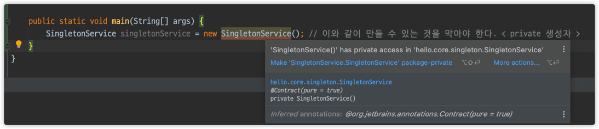

# 웹 애플리케이션과 싱글톤

````java
@DisplayName("스프링이 없는 순수한 DI 컨테이너")
@Test
void pureContainer() {
    AppConfig appConfig = new AppConfig();
    // 1. 조회 : 호출할 때마다 객체를 생성
    MemberService memberService1 = appConfig.memberService();

    // 2. 조회 : 호출할 때마다 객체를 생성
    MemberService memberService2 = appConfig.memberService();

    // 참조값이 다른 것을 확인
    System.out.println("memberService1 = " + memberService1);
    System.out.println("memberService2 = " + memberService2);

    // memberService != memberService2
    assertThat(memberService1).isNotSameAs(memberService2);
}
````

- 초당 50000개의 요청 -> 계속 생성? NO! 메모리 낭비가 심하다!
- 해결 방안은 해당 객체가 딱 1개만 생성되고, 공유하도록 설계하면 된다 -> 싱글톤 패턴


> 싱글톤 패턴
- 클래스의 인스턴스가 딱 1개만 생성되는 것을 보장하는 디자인 패턴
- 그래서 객체 인스턴스를 2개 이상 생성하지 못하도록 막아야 한다.
- private 생성자를 사용해서 외부에서 임의로 new 키워드를 사용하지 못하도록 막아야함

구현하는 방법은 굉장히 많지만, 객체를 미리 생성해두는 가장 단순하고 안전한 방법을 선택함.
지연해서 생성하는 방법도 있긴 하다(LazyPlaceHolder 방법)
```java
public class SingletonService {
    // static 영역에 단 한개만 만들어져서 올라가게 된다.
    private static final SingletonService instance = new SingletonService(); // 자기 자신을 private으로

    public static SingletonService getInstance() {
        return instance; // 자기 자신 객체 인스턴스를 단 하나만 생성해서 이를 public으로 리턴해주면 그만.
    }

    private SingletonService() {} // 외부에서 SingleTon 생성자를 호출할 수 없도록 new 키워드로 객체 인스턴스를 만들 수 없어야 함
}
```
  


> 싱글톤 패턴의 문제점
- 싱글톤 패턴을 구현하는 코드 자체가 많이 들어감 ㅡ.ㅡ
- 의존 관계상 클라이언트가 구체 클래스에 의존 -> DIP 위반!
    - 클라이언트가 `구체클래스.getInstance()` 로 가져와야 한다거나 그런 상황을 말하는 것
- 테스트하기가 어렵다
- 내부 속성을 변경하거나 초기화하기 어렵다
- private 생성자로 자식 클래스를 만들기가 어려움
- 유연성이 떨어짐ㅜ getInstance.. 등
- 안티패턴으로 불리기도 함
    - Share를 할 수 있고, 객체 한 개인 것이 보장이 되기는 하지만
    - 위와 같이 수많은 단점들이 있음
    
근데, 스프링 프레임워크는 위와 같은 스프링 프레임워크의 문제점을 전부 해결해주고
싱글톤 문제점을 모두 해결해주면서, 객체를 모두 싱글톤으로 관리? => GOD 스프링.