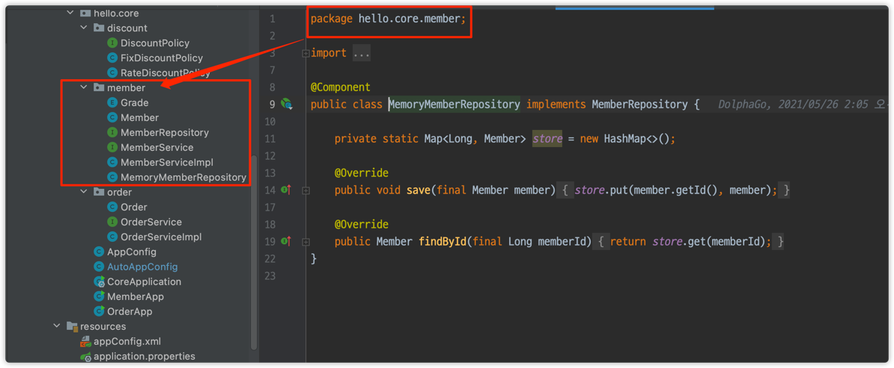

# 컴포넌트 스캔과 의존관계 자동 주입

- AppConfig에서 했던 것처럼, `@Bean`과 new~ 로 등록해야 하는 스프링 빈이 수십, 수백개가 되기도 하여 일일이 등록하기도 귀찮다.
- 스프링은 설정 정보가 없어도 자동으로 스프링 빈을 등록하는 `컴포넌트 스캔`이라는 기능을 제공한다.
- 또한 의존 관계도 자동으로 주입하는 `@Autowired`라는 기능도 제공한다.

```java
@Configuration
@ComponentScan(
        excludeFilters = @ComponentScan.Filter(type = FilterType.ANNOTATION, classes = Configuration.class) // 수동 등록은 빼준다.
)
public class AutoAppConfig {
}
```
- `@Configuration`은 내부에 `@Component`가 있기에 자동으로 컴포넌트 스캔의 대상이 된다.
- 따라서 위와 같이 수동으로 등록했던(`@Configuration` 어노테이션과 `@Bean`으로 스프링 빈을 등록했던) 기존의 `AppConfig`를 스캔 대상에서 제외한다.
- 컴포넌트 스캔을 사용하기 위해 `@ComponentScan`
- 기존 AppConfig와 다르게 `@Bean`이 없어도 자동으로 빈으로 등록이 된다.


## `@ComponentScan`
- `@ComponentScan`은 `@Component`가 붙은 모든 클래스를 스프링 빈으로 등록함.
- 이 때, 스프링 빈의 기본 이름은 클래스 명을 사용하되, 맨 앞글자만 소문자로 사용!
    - **빈 이름 기본 전략** : MemberServiceImpl class -> memberServiceImpl
    - **빈 이름 직접 지정** : `@Component("dolphaGoMemberService")`
    
## `@Autowired`
- 생성자에 `@Autowired`를 지정하면, 스프링 컨테이너가 자동으로 해당 스프링 빈을 찾아서 주입한다.
- 이때 기본 조회 전략은 `타입이 같은 빈`을 찾아서 주입한다.
    - `ac.getBean(MemberRepository.class)`와 동일하다고 이해하면 된다.
    - 그러나 충돌이 날 수도 있다. 이때는 `@Qualifier`, `@Primary` 등으로 해결한다. 뒤에서 다시 설명한다.
    

## 탐색 위치와 기본 스캔 대상
- `basePackages` : 탐색할 패키지의 시작 위치 지정
````java
@Configuration
@ComponentScan(
        basePackages = "hello.core.member",
        excludeFilters = @ComponentScan.Filter(type = FilterType.ANNOTATION, classes = Configuration.class) // 수동 등록은 빼준다.
)
public class AutoAppConfig {
}
````
  - 위와 같이 `basePackages`로 탐색할 패키지를 지정할 수 있다.
  - 여러개를 둘 수도 있다. 
    - basePackages = {"hello.core", "hello.service"}

- `basePackageClasses` : 지정한 클래스의 패키지를 탐색 시작 패키지로 지정한다.
```java
@Configuration
@ComponentScan(
        basePackageClasses = MemoryMemberRepository.class,
        excludeFilters = @ComponentScan.Filter(type = FilterType.ANNOTATION, classes = Configuration.class) // 수동 등록은 빼준다.
)
public class AutoAppConfig {
}
```
위와 같이 `MemoryMemberRepository.class`를 지정하면 해당 클래스가 속한 패키지인 core.member 패키지를 컴포넌트 스캔 패키지 영역으로 지정된다.



- 근데 지정하지 않으면?
  - `@ComponentScan`이 붙은 패키지를 시작으로 컴포넌트 스캔이 시작된다.
  - 프로젝트 시작 루트 위치에 두는 것이 좋다고 생각.
  - 참고로 스프링 부트를 사용하면 스프링 부트의 대표 시작정보인 `@SpringBootApplication`를 이 프로젝트 시작 루트 위치에 두는 것이 관례임.
  

> 컴포넌트 스캔 기본 대상
- `@Component` : 컴포넌트 스캔에 사용
- `@Controller` : 스프링 MVC 컨트롤러에서 사용, 스프링 MVC 컨트롤러로 인식
- `@Service` : 스프링 비즈니스 로직에서 사용, 특별한 처리를 하지 않음. 대신 개발자들이 핵심 비즈니스 로직이 여기 있겠구나 하고 비즈니스 계층을 인식하는데 도움이 됨
- `@Repository` : 스프링 데이터 접근 계층에서 사용, 데이터 계층의 예외를 스프링 예외로 변환해줌
- `@Configuration` : 스프링 설정 정보 사용

> 사실 어노테이션이 상속관계 개념이 없음. 어노테이션이 특정 어노테이션을 들고 잇다는 것은 자바가 지원하는게 아니라 스프링이 지원하는 기능임.
