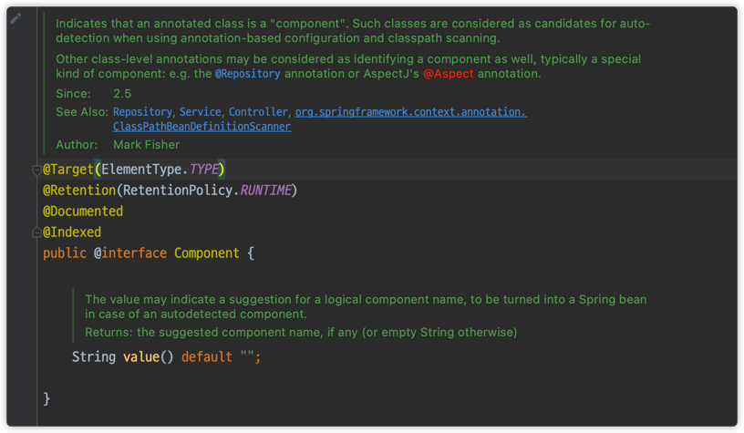

# 컴포넌트 스캔과 의존관계 자동 주입

- AppConfig에서 했던 것처럼, `@Bean`과 new~ 로 등록해야 하는 스프링 빈이 수십, 수백개가 되기도 하여 일일이 등록하기도 귀찮다.
- 스프링은 설정 정보가 없어도 자동으로 스프링 빈을 등록하는 `컴포넌트 스캔`이라는 기능을 제공한다.
- 또한 의존 관계도 자동으로 주입하는 `@Autowired`라는 기능도 제공한다.

```java
@Configuration
@ComponentScan(
        excludeFilters = @ComponentScan.Filter(type = FilterType.ANNOTATION, classes = Configuration.class) // 수동 등록은 빼준다.
)
public class AutoAppConfig {
}
```
- `@Configuration`은 내부에 `@Component`가 있기에 자동으로 컴포넌트 스캔의 대상이 된다.
- 따라서 위와 같이 수동으로 등록했던(`@Configuration` 어노테이션과 `@Bean`으로 스프링 빈을 등록했던) 기존의 `AppConfig`를 스캔 대상에서 제외한다.
- 컴포넌트 스캔을 사용하기 위해 `@ComponentScan`
- 기존 AppConfig와 다르게 `@Bean`이 없어도 자동으로 빈으로 등록이 된다.


## `@ComponentScan`
- `@ComponentScan`은 `@Component`가 붙은 모든 클래스를 스프링 빈으로 등록함.
- 이 때, 스프링 빈의 기본 이름은 클래스 명을 사용하되, 맨 앞글자만 소문자로 사용!
    - **빈 이름 기본 전략** : MemberServiceImpl class -> memberServiceImpl
    - **빈 이름 직접 지정** : `@Component("dolphaGoMemberService")`
    
## `@Autowired`
- 생성자에 `@Autowired`를 지정하면, 스프링 컨테이너가 자동으로 해당 스프링 빈을 찾아서 주입한다.
- 이때 기본 조회 전략은 `타입이 같은 빈`을 찾아서 주입한다.
    - `ac.getBean(MemberRepository.class)`와 동일하다고 이해하면 된다.
    - 그러나 충돌이 날 수도 있다. 이때는 `@Qualifier`, `@Primary` 등으로 해결한다. 뒤에서 다시 설명한다.
    

## 탐색 위치와 기본 스캔 대상
- `basePackages` : 탐색할 패키지의 시작 위치 지정
````java
@Configuration
@ComponentScan(
        basePackages = "hello.core.member",
        excludeFilters = @ComponentScan.Filter(type = FilterType.ANNOTATION, classes = Configuration.class) // 수동 등록은 빼준다.
)
public class AutoAppConfig {
}
````
  - 위와 같이 `basePackages`로 탐색할 패키지를 지정할 수 있다.
  - 여러개를 둘 수도 있다. 
    - basePackages = {"hello.core", "hello.service"}

- `basePackageClasses` : 지정한 클래스의 패키지를 탐색 시작 패키지로 지정한다.
```java
@Configuration
@ComponentScan(
        basePackageClasses = MemoryMemberRepository.class,
        excludeFilters = @ComponentScan.Filter(type = FilterType.ANNOTATION, classes = Configuration.class) // 수동 등록은 빼준다.
)
public class AutoAppConfig {
}
```
위와 같이 `MemoryMemberRepository.class`를 지정하면 해당 클래스가 속한 패키지인 core.member 패키지를 컴포넌트 스캔 패키지 영역으로 지정된다.


- 근데 지정하지 않으면?
  - `@ComponentScan`이 붙은 패키지를 시작으로 컴포넌트 스캔이 시작된다.
  - 프로젝트 시작 루트 위치에 두는 것이 좋다고 생각.
  - 참고로 스프링 부트를 사용하면 스프링 부트의 대표 시작정보인 `@SpringBootApplication`를 이 프로젝트 시작 루트 위치에 두는 것이 관례임.
  

> 컴포넌트 스캔 기본 대상
- `@Component` : 컴포넌트 스캔에 사용
- `@Controller` : 스프링 MVC 컨트롤러에서 사용, 스프링 MVC 컨트롤러로 인식
- `@Service` : 스프링 비즈니스 로직에서 사용, 특별한 처리를 하지 않음. 대신 개발자들이 핵심 비즈니스 로직이 여기 있겠구나 하고 비즈니스 계층을 인식하는데 도움이 됨
- `@Repository` : 스프링 데이터 접근 계층에서 사용, 데이터 계층의 예외를 스프링 예외로 변환해줌
- `@Configuration` : 스프링 설정 정보 사용

> 사실 어노테이션이 상속관계 개념이 없음. 어노테이션이 특정 어노테이션을 들고 잇다는 것은 자바가 지원하는게 아니라 스프링이 지원하는 기능임.


## 필터
- `includeFilters` : 컴포넌트 스캔 대상을 추가로 지정
- `excludeFilters` : 컴포넌트 스캔 대상에서 제외할 대상을 지정


다음과 같이 2개의 어노테이션을 만들어본다.
여기서 사용한 추가적인 어노테이션은 `@Component` 어노테이션에 존재하는 것들이다.



```java
@Target(ElementType.TYPE) // 클래스 타입에 지정
@Retention(RetentionPolicy.RUNTIME)
@Documented
public @interface MyIncludeComponent {
}
```

```java
@Target(ElementType.TYPE) // 클래스 타입에 지정
@Retention(RetentionPolicy.RUNTIME)
@Documented
public @interface MyExcludeComponent {
}
```

그리고, BeanA 클래스에는 `@MyIncludeComponent`를, BeanB 클래스에는 `@MyExcludeComponent`를 붙였다.

이제 테스트를 해본다.
동일한 패키지에 다음과 같은 코드를 작성했다.

```java
public class ComponentFilterAppConfigTest {

    @DisplayName("필터 스캔")
    @Test
    void filterScan() {
        ApplicationContext ac = new AnnotationConfigApplicationContext(ComponentFilterAppConfig.class);
        BeanA beanA = ac.getBean("beanA", BeanA.class);
        assertThat(beanA).isNotNull();

        assertThrows(NoSuchBeanDefinitionException.class, () -> ac.getBean("beanB", BeanB.class));
    }

    @Configuration
    @ComponentScan(
            includeFilters = @Filter(type = FilterType.ANNOTATION, classes = MyIncludeComponent.class),
            excludeFilters = @Filter(classes = MyExcludeComponent.class) // type = FilterType.ANNOTATION는 기본값이라서 생략해도 된다.
    )
    static class ComponentFilterAppConfig {
    }
}
```

Config 설정으로 `@Filter`를 이용하여 include, exclude를 지정해주었다.
참고로 여기서 `@Filter`의 기본 타입은 Annotation이기에 생략해줘도 된다.

> 필터 타입(FilterType) 옵션
- FilterType은 5가지 옵션이 있다.
  - ANNOTATION: 기본값, 애노테이션을 인식해서 동작한다. 
    - ex) org.example.SomeAnnotation
  - ASSIGNABLE_TYPE: 지정한 타입과 자식 타입을 인식해서 동작한다. 
    - ex) org.example.SomeClass
  - ASPECTJ: AspectJ 패턴 사용
    - ex) org.example..*Service+
  - REGEX: 정규 표현식
    - ex) org\.example\.Default.*
  - CUSTOM: TypeFilter 이라는 인터페이스를 구현해서 처리 
    - ex) org.example.MyTypeFilter

예를 들어서 BeanA로 컴포넌트 스캔 대상에서 제외하고 싶다면 다음과 같이 설정하면 된다.
```java
@Configuration
@ComponentScan(
        includeFilters = @Filter(type = FilterType.ANNOTATION, classes = MyIncludeComponent.class),
        excludeFilters = { @Filter(classes = MyExcludeComponent.class), @Filter(type = FilterType.ASSIGNABLE_TYPE, classes = BeanA.class) }
)
static class ComponentFilterAppConfig {
}
```


## 중복 등록과 충돌
1. 자동 빈 vs 자동 빈
2. 자동 빈 vs 수동 빈

@Component("이름")을 동일하게 하고, 자동 빈 등록시엔 어떻게 될까?
MemberServiceImpl과 OrderServiceImpl의 Bean이름을 "service"로 변경하고 실행한 결과는 다음과 같다.
```
org.springframework.beans.factory.BeanDefinitionStoreException: Failed to parse configuration class [hello.core.AutoAppConfig]; nested exception is org.springframework.context.annotation.ConflictingBeanDefinitionException: Annotation-specified bean name 'service' for bean class [hello.core.order.OrderServiceImpl] conflicts with existing, non-compatible bean definition of same name and class [hello.core.member.MemberServiceImpl]
```
- 그래서 자동 빈 vs 자동 빈은 에러로그를 보면서 해결하면 된다.


> 수동 빈 등록과 자동 빈 등록이 충돌하면 어떻게 될까?

memoryMemberRepository와 이름을 똑같이 해서 수동 Bean을 생성해보겠다.
기억하고 있겠지만, 따로 설정하지 않으면, 메서드 이름을 따서 bean 이름을 짓는다.
```java
@Configuration
@ComponentScan(
//        basePackageClasses = MemoryMemberRepository.class,
        excludeFilters = @ComponentScan.Filter(type = FilterType.ANNOTATION, classes = Configuration.class) // 수동 등록은 빼준다.
)
public class AutoAppConfig {

  @Bean
  MemberRepository memoryMemberRepository() {
    return new MemoryMemberRepository();
  }
}
```
그리고 이 테스트는 성공한다.
```java
@Test
void basicScan() {
    ApplicationContext ac = new AnnotationConfigApplicationContext(AutoAppConfig.class);

    MemberService memberService = ac.getBean(MemberService.class);
    assertThat(memberService).isInstanceOf(MemberService.class);
}
```

- **수동 빈 등록이 우선권을 가진다. (수동 빈이 자동 빈을 오버라이딩 해버림)**
- 그렇지만 수동 빈 등록시 이러한 충돌을 해결하는 과정을 스프링 측에서는 로그를 남겨준다.
```text
DEBUG org.springframework.beans.factory.support.DefaultListableBeanFactory - Overriding bean definition for bean 'memoryMemberRepository' with a different definition: replacing [Generic bean: class [hello.core.member.MemoryMemberRepository]; scope=singleton; abstract=false; lazyInit=null; autowireMode=0; dependencyCheck=0; autowireCandidate=true; primary=false; factoryBeanName=null; factoryMethodName=null; initMethodName=null; destroyMethodName=null; defined in file [/Users/user/Documents/github/spring/spring-core-example/out/production/classes/hello/core/member/MemoryMemberRepository.class]] with [Root bean: class [null]; scope=; abstract=false; lazyInit=null; autowireMode=3; dependencyCheck=0; autowireCandidate=true; primary=false; factoryBeanName=autoAppConfig; factoryMethodName=memberRepository; initMethodName=null; destroyMethodName=(inferred); defined in hello.core.AutoAppConfig]
```

- 그런데 현실은 개발자가 의도적으로 설정해서 이런 결과가 만들어지기 보단 실수인 경우가 대부분
- 그래서 최근 스프링 부트에선 수동 빈 등록과 자동 빈 등록이 충돌나면 오류가 발생하도록 설정을 바꿨음
- 그래서 스프링 어플리케이션 실행 시 다음과 같은 로그가 생성된다.
```text
***************************
APPLICATION FAILED TO START
***************************

Description:

The bean 'memberRepository', defined in class path resource [hello/core/AutoAppConfig.class], could not be registered. A bean with that name has already been defined in class path resource [hello/core/AppConfig.class] and overriding is disabled.

Action:

Consider renaming one of the beans or enabling overriding by setting spring.main.allow-bean-definition-overriding=true
```
그래서 오버라이딩 하고 싶다면 `spring.main.allow-bean-definition-overriding=true`를 옵션으로 주면 된다.